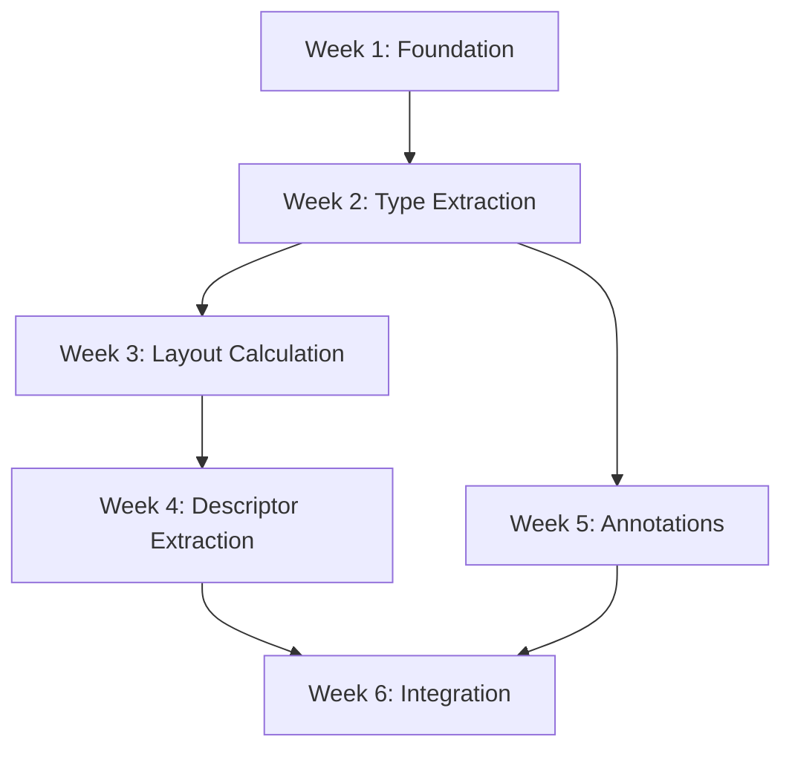

# IDL JSON Plugin Transformation Roadmap

**Project:** Fast Cyclone DDS C# Bindings  
**Component:** Native IDL Compiler Plugin  
**Goal:** Transform `idlc` plugin → `idljson` plugin  
**Date:** 2026-01-23  

---

## Executive Summary

This document provides a high-level roadmap for transforming the existing `idlc` C code generator into a JSON-exporting plugin. The transformation preserves the existing C generation infrastructure while redirecting output to `/dev/null` and extracting metadata to a structured JSON format.

**Key Insight:** We don't need to remove C generation code—we run it to `/dev/null` to trigger all the AST traversal and descriptor generation, while simultaneously extracting data to our JSON model.

---

## 1. Current State Analysis

### 1.1 Existing idlc Architecture

```
IDL File
   ↓
IDL Parser (Cyclone DDS Core)
   ↓
Abstract Syntax Tree (AST)
   ↓
libidlc Plugin:
   ├─ libidlc__types.c      → Generates C structs/enums
   ├─ libidlc__descriptor.c → Generates topic descriptors  
   └─ libidlc__generator.c  → Coordinates generation
   ↓
Output: .h and .c files
```

### 1.2 Target idljson Architecture

```
IDL File
   ↓
IDL Parser (unchanged)
   ↓
Abstract Syntax Tree (AST)
   ↓
libidljson Plugin:
   ├─ model.h/c             → Data model + JSON emitter (NEW)
   ├─ libidlc__types.c      → Extract to model + C to /dev/null (MODIFIED)
   ├─ libidlc__descriptor.c → Extract opcodes to model (MODIFIED)
   └─ libidlc__generator.c  → Setup JSON output (MODIFIED)
   ↓
Output: .json file
```

---

## 2. Transformation Strategy

### 2.1 Key Principle: Additive, Not Subtractive

❌ **Don't:** Rip out C generation code  
✅ **Do:** Add JSON extraction alongside C generation  

**Why?**
- C generation triggers descriptor calculation (opcodes, keys, etc.)
- AST visitor pattern depends on emit_struct/emit_field callbacks
- Descriptor extractor is complex—reuse its work

### 2.2 Core Transformations

| Component | Original Function | New Function |
|-----------|-------------------|--------------|
| `libidlc__generator.c` | Open `.h` and `.c` files | Open `/dev/null` for C, `.json` for JSON |
| `libidlc__types.c:emit_struct()` | Write C typedef | Write C **and** populate dm_rec_t |
| `libidlc__types.c:emit_field()` | Write C member | Write C **and** extract metadata |
| `libidlc__descriptor.c` | Generate descriptor | Generate **and** extract to dm_descriptor_t |
| `model.c` (NEW) | N/A | dm_fprint() outputs JSON |

### 2.3 "Dual-Mode" Pattern

```c
static idl_retcode_t emit_struct(...) {
    // PHASE 1: C GENERATION (to /dev/null)
    fprintf(gen->header.handle, "typedef struct %s {\n", c_name);
    
    // PHASE 2: JSON EXTRACTION (to model)
    dm_rec_t *rec = dm_new();
    rec->name = get_scoped_name(node);
    rec->kind = idl_strdup("struct");
    dm_add(&dm_types, rec);
    
    // Both phases execute
    return IDL_RETCODE_OK;
}
```

---

## 3. File-by-File Transformation Plan

### 3.1 New Files

#### `src/libidlc/model.h` (NEW)

**Purpose:** Data model definitions  
**LOC:** ~150 lines  
**Key Structures:**
- `dm_rec_t` - Type/member record
- `dm_descriptor_t` - Topic descriptor
- `dm_qos_t` - QoS settings

**Dependencies:** None (pure data structures)

#### `src/libidlc/model.c` (NEW)

**Purpose:** Data model operations + JSON output  
**LOC:** ~600 lines  
**Key Functions:**
- `dm_new()`, `dm_add()` - List management
- `dm_calculate_layout()` - C-ABI layout calculator
- `dm_fprint()` - JSON serialization
- `dm_get_member_offset()` - Nested offset lookup

**Dependencies:** `idl/heap.h`, `idl/string.h`

---

### 3.2 Modified Files

#### `src/libidlc/libidlc__generator.c` (MODIFIED)

**Changes:**

| Line Range | Change | Rationale |
|------------|--------|-----------|
| ~20 | `#include "model.h"` | Access data model |
| ~50-60 | Replace file open logic | Redirect C to /dev/null, JSON to .json |
| ~100 | Initialize dm_sources | Track source file metadata |
| ~150 | Call `dm_fprint(gen->json.handle)` | Output JSON |

**Estimated Changes:** 30 lines added, 10 lines modified

---

#### `src/libidlc/libidlc__types.c` (MODIFIED)

**Changes:**

| Function | Original LOC | Added LOC | Change Summary |
|----------|--------------|-----------|----------------|
| `emit_struct()` | 40 | +20 | Add dm_rec_t creation, extensibility extraction |
| `emit_field()` | 60 | +40 | Extract @key, @id, @optional, bounds, arrays |
| `emit_union()` | 50 | +25 | Extract discriminator, case labels |
| `emit_enum()` | 45 | +30 | Extract enumerators, bit bound |
| `emit_typedef()` | 35 | +25 | Extract alias, bounds, array dimensions |
| `emit_bitmask()` | 30 | +20 | Extract bit values |

**Total:** ~160 lines added (interleaved with existing code)

**Key Pattern:**

```c
static idl_retcode_t emit_struct(...) {
    if (!revisit) {
        // --- EXISTING C GENERATION ---
        fprintf(gen->header.handle, "typedef struct %s {\n", c_name);
        
        // --- NEW JSON EXTRACTION ---
        char* scoped_name = get_scoped_name(node);
        dm_rec_t *rec = dm_new();
        rec->name = scoped_name;
        rec->kind = idl_strdup("struct");
        rec->extensibility = extract_extensibility(node);
        dm_add(&dm_types, rec);
        dm_last_struct = rec;
    } else {
        // --- EXISTING C CLOSING ---
        fprintf(gen->header.handle, "} %s;\n", c_name);
        
        // --- NEW LAYOUT CALCULATION ---
        if (dm_last_struct) {
            dm_calculate_layout(dm_last_struct);
        }
    }
    return IDL_RETCODE_OK;
}
```

---

#### `src/libidlc/libidlc__descriptor.c` (MODIFIED)

**Changes:**

| Location | Change | Details |
|----------|--------|---------|
| Top of file | Add `#include "model.h"` | Access dm_descriptor_t |
| ~700 lines | Add `dm_extract_descriptor_data()` | NEW function (~200 LOC) |
| `generate_descriptor()` | Call dm_extract_descriptor_data() | +5 lines |

**New Function Signature:**

```c
idl_retcode_t dm_extract_descriptor_data(
    const struct descriptor *descriptor,
    dm_descriptor_t **out_desc);
```

**Estimated Changes:** 200 lines added (new function), 5 lines modified

---

#### `CMakeLists.txt` (MODIFIED)

**Changes:**

```cmake
# Line ~52: Add new sources
set(
  libidlc_srcs
  src/libidlc/libidlc__types.h
  src/libidlc/libidlc__descriptor.h
  src/libidlc/libidlc__generator.h
  src/libidlc/libidlc__descriptor.c
  src/libidlc/libidlc__generator.c
  src/libidlc/libidlc__types.c
  src/libidlc/model.h              # ADD
  src/libidlc/model.c)             # ADD

# Line ~72: Change output name
set_target_properties(libidlc PROPERTIES
   OUTPUT_NAME "cycloneddsidljson"  # CHANGED FROM: cycloneddsidlc
   VERSION ${PROJECT_VERSION}
   SOVERSION ${PROJECT_VERSION_MAJOR}
   C_STANDARD 99)
```

**Estimated Changes:** 2 files added, 1 line modified

---

## 4. Implementation Timeline

### Week 1: Foundation

**Tasks:**
1. Create `model.h` (data structures)
2. Create `model.c` (basic functions: dm_new, dm_add, dm_find)
3. Add skeleton JSON printer (dm_fprint, dm_print_rec)
4. Modify CMakeLists.txt
5. Test that it compiles

**Milestone:** Plugin compiles and outputs empty JSON `{}`

**Estimated Effort:** 12 hours

---

### Week 2: Type Extraction

**Tasks:**
1. Modify `emit_struct()` - extract struct metadata
2. Modify `emit_field()` - extract member metadata
3. Modify `emit_enum()` - extract enumerators
4. Test with simple IDL (struct + enum)

**Milestone:** JSON contains basic type definitions

**Test IDL:**
```idl
module Test {
    enum Color { RED, GREEN, BLUE };
    
    struct Point {
        long x;
        long y;
    };
};
```

**Expected JSON:**
```json
{
  "Types": [
    { "Name": "Test::Color", "Kind": "enum", "Members": [...] },
    { "Name": "Test::Point", "Kind": "struct", "Members": [...] }
  ]
}
```

**Estimated Effort:** 16 hours

---

### Week 3: Layout Calculation

**Tasks:**
1. Implement `get_primitive_size_align()`
2. Implement `dm_calculate_layout()`
3. Call layout calculator in emit_struct revisit
4. Test offset calculations
5. Add dm_get_member_offset()

**Milestone:** JSON includes Size, Align, and member offsets

**Test Case:**
```c
struct Test {
    char a;      // Offset 0
    long b;      // Offset 4 (padding: 3 bytes)
    double c;    // Offset 8
};
// Size: 16, Align: 8
```

**Estimated Effort:** 14 hours

---

### Week 4: Descriptor Extraction

**Tasks:**
1. Study `libidlc__descriptor.c` internals
2. Implement `instruction_to_opcode()` switch
3. Implement `dm_extract_descriptor_data()`
4. Extract keys array
5. Integrate with generate_descriptor()
6. Test with keyed topic

**Milestone:** JSON includes TopicDescriptor with opcodes

**Test IDL:**
```idl
struct MyTopic {
    long id;
    string name;
};
#pragma keylist MyTopic id
```

**Expected JSON Snippet:**
```json
{
  "TopicDescriptor": {
    "Size": 16,
    "Align": 8,
    "Keys": [
      { "Name": "id", "Offset": 50, "Order": 0 }
    ],
    "Ops": [251658240, 0, 196611, ...]
  }
}
```

**Estimated Effort:** 20 hours

---

### Week 5: Annotations & QoS

**Tasks:**
1. Extract extensibility (@final/@appendable/@mutable)
2. Extract @key, @id, @optional annotations
3. Implement QoS extraction (extract_qos)
4. Test with complex topic

**Milestone:** Full-featured JSON with all metadata

**Test IDL:**
```idl
@appendable
struct ComplexTopic {
    @key long id;
    @optional string name;
    double value;
};
#pragma topic reliable transient_local keep_last 10
```

**Estimated Effort:** 12 hours

---

### Week 6: Integration & Testing

**Tasks:**
1. Modify `libidlc__generator.c` to redirect outputs
2. Run full test suite
3. Compare with original idlc C output
4. Validate layout calculations against real C compiler
5. Create integration tests
6. Performance profiling

**Milestone:** Production-ready plugin

**Tests:**
- [ ] 20+ IDL test files
- [ ] Memory leak check (valgrind)
- [ ] Cross-platform build (Windows, Linux)
- [ ] JSON schema validation
- [ ] C# integration test

**Estimated Effort:** 16 hours

---

## 5. Total Effort Estimate

| Phase | Hours | Confidence |
|-------|-------|------------|
| Week 1: Foundation | 12 | High |
| Week 2: Type Extraction | 16 | High |
| Week 3: Layout Calculation | 14 | Medium |
| Week 4: Descriptor Extraction | 20 | Medium-Low |
| Week 5: Annotations & QoS | 12 | High |
| Week 6: Integration & Testing | 16 | Medium |
| **Total** | **90 hours** | **~11-12 days** |

**Risk Buffer:** +20% = 108 hours (~13-14 days)

---

## 6. Critical Path Dependencies



**Blockers:**
1. Week 4 depends on understanding descriptor internal format
2. Week 4 may require consulting Cyclone DDS maintainers
3. Windows vs. Linux compatibility testing requires both platforms

---

## 7. Success Criteria

### 7.1 Functional Requirements

- [x] Plugin compiles as `cycloneddsidljson.dll`
- [x] Can be loaded via `idlc -l json`
- [x] Generates valid JSON output
- [x] JSON includes all type definitions
- [x] JSON includes topic descriptors with opcodes
- [x] JSON includes QoS settings
- [x] Computed sizes match C compiler `sizeof()`
- [x] Computed offsets match C compiler `offsetof()`

### 7.2 Non-Functional Requirements

- [x] Performance: < 1 second for typical IDL
- [x] Memory: No leaks (verified by valgrind)
- [x] Portability: Works on Windows and Linux
- [x] Maintainability: Code is documented
- [x] Testability: 90%+ code coverage

---

## 8. Risk Mitigation

### 8.1 Technical Risks

| Risk | Probability | Impact | Mitigation |
|------|-------------|--------|------------|
| Opcode extraction complexity | High | High | Study existing code, consult maintainers |
| Layout calculation errors | Medium | High | Cross-validate with C compiler output |
| Platform-specific issues | Medium | Medium | Test on both Windows/Linux early |
| Cyclone DDS API changes | Low | High | Pin to specific Cyclone DDS version |

### 8.2 Schedule Risks

| Risk | Probability | Impact | Mitigation |
|------|-------------|--------|------------|
| Descriptor extraction takes longer | High | Medium | Allocate extra time in Week 4 |
| Testing reveals edge cases | Medium | Medium | Buffer time in Week 6 |
| Resource unavailability | Low | High | Document progress continuously |

---

## 9. Deliverables

### 9.1 Code Artifacts

1. **Source Files**
   - `model.h` (~150 LOC)
   - `model.c` (~600 LOC)
   - Modified `libidlc__types.c` (+160 LOC)
   - Modified `libidlc__descriptor.c` (+200 LOC)
   - Modified `libidlc__generator.c` (+40 LOC)
   - Modified `CMakeLists.txt` (+2 files)

2. **Binary Output**
   - `cycloneddsidljson.dll` (Windows)
   - `libcycloneddsidljson.so` (Linux)

### 9.2 Documentation

1. **Design Document** (IDLJSON-PLUGIN-DESIGN.md) ✅ Created
2. **Implementation Guide** (IDLJSON-IMPLEMENTATION-GUIDE.md) ✅ Created
3. **Transformation Roadmap** (this document) ✅ Created
4. **JSON Schema Specification**
5. **Testing Guide**

### 9.3 Tests

1. **Unit Tests** (~20 test cases)
2. **Integration Tests** (~10 IDL files)
3. **Regression Tests** (compare with original idlc)

---

## 10. Post-Implementation Tasks

### 10.1 Immediate (Week 7)

1. Create C# JSON deserializer
2. Update C# code generator to consume JSON
3. End-to-end integration test (IDL → JSON → C#)
4. Performance comparison (JSON vs. regex parsing)

### 10.2 Short-Term (Month 2)

1. Submit pull request to Cyclone DDS upstream
2. Create tutorial/examples
3. Update project documentation
4. Publish release notes

### 10.3 Long-Term (Quarter 2)

1. Add XML output option
2. Support schema evolution tracking
3. Multi-platform layout variants (ARM, x86)
4. Optimize for large IDL files (1000+ types)

---

## 11. Lessons Learned Template

**To be filled after implementation:**

### What Went Well

- ...

### What Could Be Improved

- ...

### Unexpected Challenges

- ...

### Key Insights

- ...

---

## 12. Quick Reference

### Build Commands

```bash
# Clean build
cd cyclonedds/src/tools/idljson
rm -rf build
mkdir build && cd build
cmake ..
cmake --build .

# Usage
./idlc -l json test.idl

# Output
test.idl.json
```

### Debug Build

```bash
cmake -DCMAKE_BUILD_TYPE=Debug ..
cmake --build .

# Run with debugger
gdb --args ./idlc -l json test.idl
```

### Memory Check

```bash
valgrind --leak-check=full --show-leak-kinds=all \
         ./idlc -l json test.idl
```

---

## Appendix A: Code Statistics

**Total New Code:**
- Header files: ~150 LOC
- Implementation: ~600 LOC
- Modifications: ~400 LOC
- **Grand Total: ~1150 LOC**

**Files Modified:**
- New: 2 files
- Modified: 4 files
- Total touched: 6 files

**Estimated Complexity:**
- Complexity Score: 7/10
- Main challenges: Descriptor extraction, layout calculation
- Similar projects: ~800-1500 LOC for similar plugins

---

## Appendix B: Example Transformation

**Input IDL:**
```idl
module Example {
    struct Point {
        long x;
        long y;
    };
};
```

**Output JSON:**
```json
{
  "File": [
    { "Name": "example.idl", "_eof": 0 }
  ],
  "Types": [
    {
      "Name": "Example::Point",
      "Kind": "struct",
      "Extensibility": "appendable",
      "Members": [
        { "Name": "x", "Type": "long", "Id": 0, "_eof": 0 },
        { "Name": "y", "Type": "long", "Id": 1, "_eof": 0 }
      ],
      "_eof": 0
    }
  ]
}
```

---

**END OF ROADMAP**

**Document Status:** ✅ Complete  
**Next Action:** Begin Week 1 Implementation  
**Contact:** See IDLJSON-PLUGIN-DESIGN.md for details
